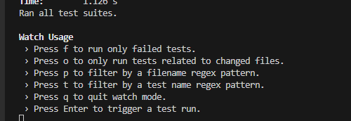

# DevEx + Developer Productivity

## DevEx
Se analizo el proyecto teniendo en cuenta las 3 dimensiones de DevEx
### Feedback loops
**Estado original del proyecto:**
- El proyecto no contaba con pruebas unitarias, ni alguna estrategia de integración continua.
- El proyecto tampoco define una estrategia de despliegue o implementación de ningún tipo.

**Estado actual de esta versión del proyecto**

- Cómo parte de la entrega anterior [CSDT_PrimeraEntrega2024.md](CSDT_PrimeraEntrega2024.md) se realizo la integración de la herramienta de SonarCloud para recibir retroalimentación de esta herramienta en cada pull request o al subir cambios directamente a master.
- En la entrega anterior también se realizo la configuración para poder ejecutar pruebas con el comando `npm run test`, generar la covertura con el comando `npm run coverage` y una ejecución de pruebas especial con el comando `npm run test:watch`. Todos los comandos agregados son una ayuda para retroalimentar información al desarrollador pero el comando `npm run test:watch` pienso tiene una mayor relevancia en este aspecto ya que si lo ejecutamos tendremos un menu activo en consola con el que podemos ir ejecutando las pruebas mientras vamos desarrollando.
    
- Cómo parte de esta entrega se agrego al workflow una github action para validar la instalación, construcción y ejecución de pruebas del proyecto. Con el objetivo de recibir la retroalimentación del estado de los paquetes y las pruebas en caso de que algo en los paquetes o en las pruebas este mal, tener esta verificación de manera automática antes de subir cualquier cambio y no dejarle toda la responsabilidad de esta validación a los desarrolladores.

### Cognitive load
- Respecto al código no es difícil de entender, son funciones o líneas muy cortas por archivo por lo que la complejidad del código es baja.
- Debuggear los errores no es complejo por la naturaleza del proyecto, por lo general si algo falla es un comando y se buscaría el error en el archivo del comando.
- El proyecto tiene muy poca documentación, solo tiene los pasos básicos en el readme pero no es tan explicito con las instrucciones para ejecutar el bot. Una mejora en el proyecto que reduciría la carga cognitiva del desarrollador sería documentar explícitamente estos procesos de instalación y configuración en alguna especie de guía.
- Otra mejora podría ser documentar los comandos del bot y mantener actualizado cuales funcionan, cuales no y cuales requieren configuraciones adicionales.

